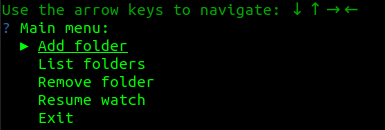
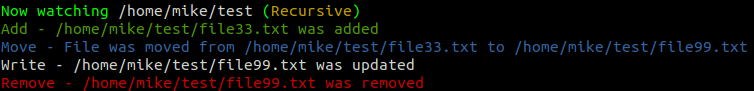

# GoFileWatcher

GoFileWatcher is a command line utility for monitoring file changes. 
If you are looking for a go library for use within another application, see 
https://github.com/mikerapa/FolderWatcher. 

## Usage

Running the application in linux

`./GoFileWatcher`

Running the application in Windows

`GoFileWatcher.exe`

Command line flags

`      --help         Show context-sensitive help (also try --help-long and
                     --help-man).`
                     
  `-p, --paths=PATHS  List of paths separated by semicolons.`
  
  `-r, --recursive    By default, the watcher is recursive. Use --no-recursive to
                     make the watcher non-recursive.`
                     
### Menu System
If the application starts with a folder path specified on command line, the application will start watching
the specified folder without displaying the main menu. The main menu will display if a path has not been 
provided. You can return to the main menu by pressing Enter at any time. File events are not displayed
while the menu is active.

| Action | Description |
| ------- | -------|
| Add Folder | specify a folder path to watch |
| List Folders | see a list of folders the application is watching |
| Remove Folder | choose a folder path to stop watching |
| Resume Watch | Exit the main menu and return to viewing file events |
| Exit | Quit the application |

### Output 
GoFileWatcher captures add, delete, move and update events.

## Known Limitations
1. Hidden files are not tracked. 
2. Files moved from a watched folder to an unwatched folder will be recorded as a Remove event.
3. In Windows, some move events from one watched folder to another watched folder will be represented 
   as a Remove and an Add event.

## Future development 
- [ ] Hidden File - Add the ability to track events for hidden files. 

## Building from Code
This application requires go version 1.15 or higher. 

Download the latest code from https://github.com/mikerapa/GoFileWatcher/releases/. 

Run `go build`